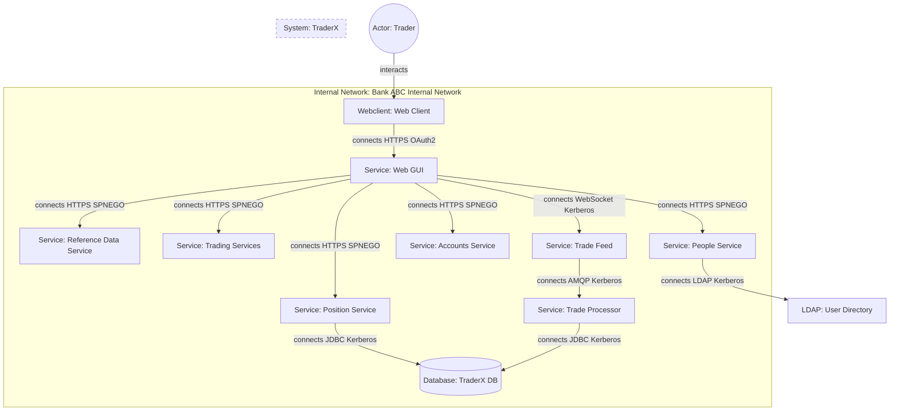

```mermaid
flowchart TB
    web_client[Webclient: Web Client]
    web_gui_process[Service: Web GUI]
    position_service[Service: Position Service]
    traderx_db[(Database: TraderX DB)]
    reference_data_service[Service: Reference Data Service]
    trading_services[Service: Trading Services]
    trade_feed[Service: Trade Feed]
    trade_processor[Service: Trade Processor]
    accounts_service[Service: Accounts Service]
    people_service[Service: People Service]

    traderx_trader((Actor: Trader))
    user_directory[LDAP: User Directory]

    subgraph internal_bank_network [Internal Network: Bank ABC Internal Network]
        web_client
        web_gui_process
        position_service
        traderx_db
        reference_data_service
        trading_services
        trade_feed
        trade_processor
        accounts_service
        people_service
    end

    subgraph traderx_system [System: TraderX]
        web_client
        web_gui_process
        position_service
        traderx_db
        reference_data_service
        trading_services
        trade_feed
        trade_processor
        accounts_service
        people_service
    end

    traderx_trader -->|interacts| web_client
    web_client -->|connects HTTPS OAuth2| web_gui_process
    web_gui_process -->|connects HTTPS SPNEGO| position_service
    position_service -->|connects JDBC Kerberos| traderx_db
    web_gui_process -->|connects HTTPS SPNEGO| reference_data_service
    web_gui_process -->|connects HTTPS SPNEGO| trading_services
    web_gui_process -->|connects WebSocket Kerberos| trade_feed
    trade_feed -->|connects AMQP Kerberos| trade_processor
    trade_processor -->|connects JDBC Kerberos| traderx_db
    web_gui_process -->|connects HTTPS SPNEGO| accounts_service
    web_gui_process -->|connects HTTPS SPNEGO| people_service
    people_service -->|connects LDAP Kerberos| user_directory

    %% Custom styles to indicate 'composed-of' relationship visually
    style traderx_system stroke-dasharray: 5 5
```
